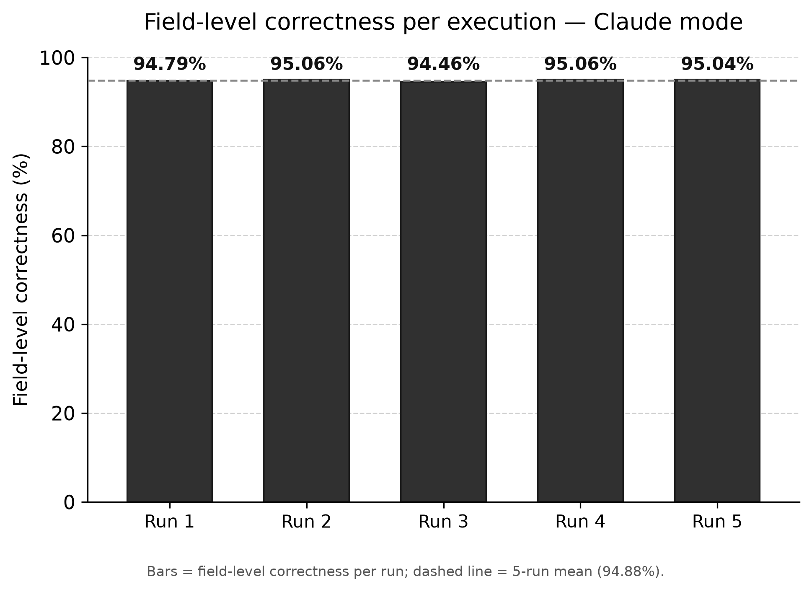

# Claude-mode run-to-run variance study

An archived record of how the workflow's output varies across repeated runs in Claude mode
(`WORKFLOW_MODE = "claude"`). The workflow is near-deterministic: it runs the model at its most
repeatable setting (temperature 0), but LLM services are still not perfectly reproducible even
then, so repeated runs can differ slightly. This study quantifies that variation on the same metric
the thesis reports, field-level correctness (the thesis headline is 95.6%).

## Method

- **Runs:** 5 independent runs on the same input, identical configuration.
- **Input:** `input_files/reports/workflow_evaluation_sample/` (20 reports).
- **Reference (gold standard):** `input_files/gold_standards/workflow_evaluation_sample/` (241 finds).
- **Model:** `claude-sonnet-4-6`, `temperature=0` (see `config.py`).
- **Config:** `WORKFLOW_MODE = "claude"`; all five runs used the same configuration.
- **Metric:** field-level correctness, the percentage of field values judged correct (an exact or
  acceptable match to the reference), across 5 fields per finding (site, pottery, typology, start
  date, end date). This is the same metric defined in [../results.md](../results.md).
- **Scoring:** `evaluation/evaluate_granular.py`, run on each of the 5 runs.
- **Date:** 2026-06-28.

## Contents

```
claude_variance/
├── README.md                            # this file
├── reports/run_1..run_5/                # the workflow's raw output for each of the 5 runs
├── scores/run_1..run_5/                 # the scoring results for each run
├── variance_adjudication_worksheet.csv  # the hand-reviewed decisions on unclear matches
├── variance_summary_raw.csv             # per-run correctness as first measured (kept for reference)
├── variance_summary_corrected.csv       # per-run correctness after reconciliation (the reported results)
├── pool_discrepancies.py                # builds the blank review worksheet
├── build_raw_summary.py                 # builds variance_summary_raw.csv
├── apply_adjudication.py                # applies the worksheet decisions, builds variance_summary_corrected.csv
├── generate_variance_charts.py          # produces the chart
└── chart_outputs/
    └── correctness_per_run.png          # the per-run correctness chart
```

Every file except the hand-reviewed worksheet is regenerated by the scripts above.

## Results

Field-level correctness across the 5 identical runs:



| | run 1 | run 2 | run 3 | run 4 | run 5 | mean | SD | range |
|---|---|---|---|---|---|---|---|---|
| Field-level correctness | 94.79% | 95.06% | 94.46% | 95.06% | 95.04% | **94.88%** | **0.26 pp** | 0.60 pp |

*mean* = average of the 5 runs; *SD* (standard deviation) = how much a typical run differs from the
average; *range* = highest value minus lowest; *pp* = percentage points.

The five runs span just 0.6 percentage points (94.46% to 95.06%, averaging 94.88%). The workflow is
therefore **near-deterministic**: repeating it produces essentially the same result, so a single run
reliably reflects its performance.

*Note: these numbers are reconciled by hand. The separate scoring tool matches each find to the
reference (gold standard) by name, so it sometimes cannot pair up a correctly extracted find that
the workflow labeled differently but equivalently, counting it as both "missing" and "extra". This
is a difficulty with the scoring tool rather than a workflow error, and it is what the manual
reconciliation corrects.*
