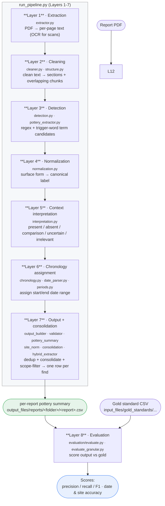

# Architecture

This is the end-to-end data flow. Each layer consumes the previous layer's output and adds one kind of
information, until a report becomes a clean table of dated pottery finds. For the *why*, see
[overview.md](overview.md). For each layer in depth, see [specs/](specs/).

## Data flow

## Reading the flow

- **Layers 1-7 run in sequence inside `run_pipeline.py`.** A report PDF goes in; one pottery-summary
  CSV comes out. `main(pdf_path)` runs one report; `run_batch()` runs every PDF in a folder.
- **Layer 7 is where most of the work happens.** Getting from many raw mentions to *one row per
  physical find* is a long, conservative cascade: deduplication, coreference consolidation, enrichment
  with canonical names/dates, site resolution, and the Roman-period scope filter. In the AI modes it
  can instead use the **hybrid extractor**, where the model reads the whole report and returns the
  find list directly (still grounded by verbatim quotes and the canonical date tables).
- **Layer 8 is separate.** It does not run during a normal pipeline run; it's the research harness that
  scores the produced summaries against gold standards. See
  [../research/evaluation.md](../research/evaluation.md).

## Where AI enters

Every AI-assisted step is governed by `WORKFLOW_MODE` (see
[../design/workflow_modes.md](../design/workflow_modes.md)). In **Rules-only mode** the AI-gated steps
in Layers 3, 5, 6, and 7 are all switched off, and the whole flow is deterministic. The rule-based
detection, normalization, and typology/period date lookups run identically in every mode. Note that
Layer 3's AI gate `POTTERY_EXTRACT_LLM_USE` is off by default (`False`), so its trigger-based pottery
extraction is rule-only even outside Rules-only mode.

## Inputs and outputs at a glance

| Role | Path |
|---|---|
| Input report PDF | `input_files/reports/<folder>/<report>.pdf` |
| Gold standard (for evaluation) | `input_files/gold_standards/<folder>/<report>.csv` |
| Pipeline output | `output_files/reports/<folder>/<report>.csv` |
| Generated detection patterns | `data/patterns/` |
| Source vocabularies + reference maps | `data/vocabularies/` |

See [../reference/data_files.md](../reference/data_files.md) for what each data file is.
