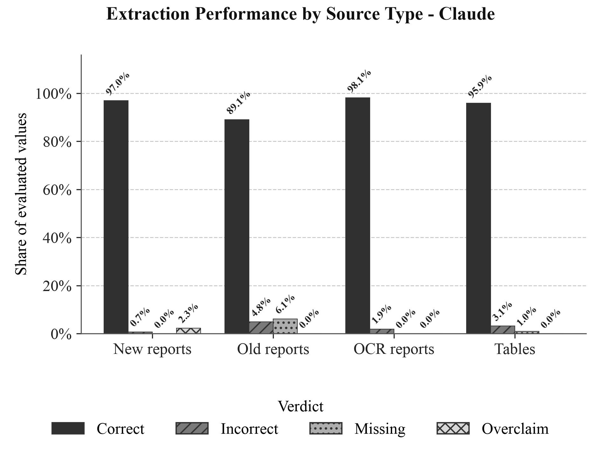
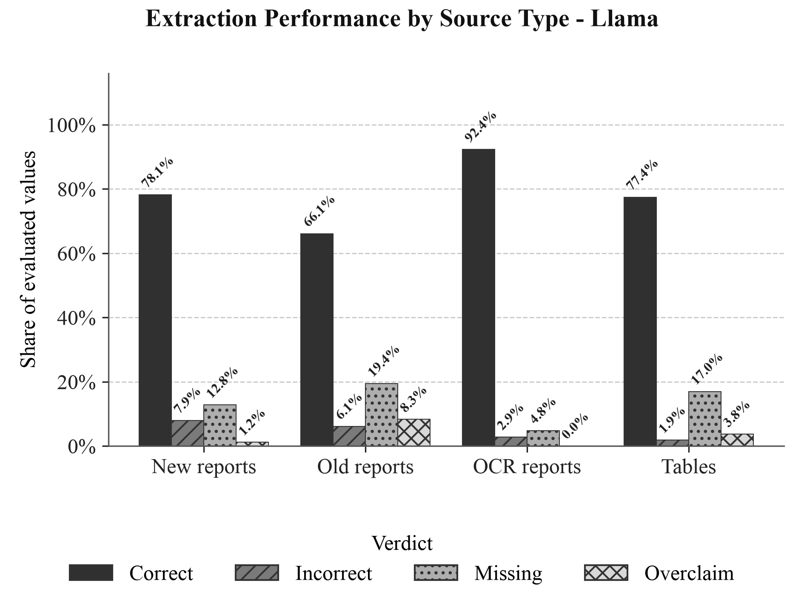
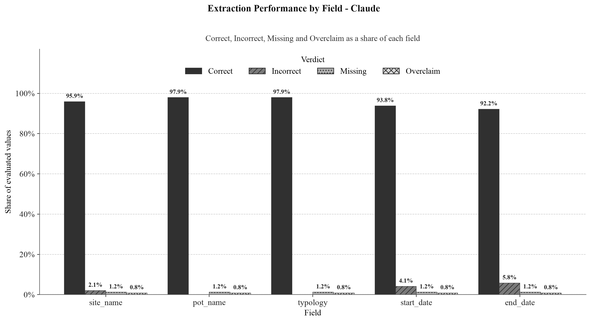
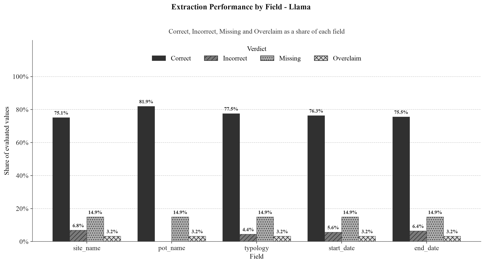

# Chart generator

`generate_charts.py` produces the evaluation figures,
comparing the three workflow modes - **Rules-only**, **Claude** and **Llama** - on the
granular evaluation results.

## What it does

The script reads the per-report granular evaluation summaries (one `granular_summary.csv`
per mode) and renders the publication-ready charts. It is:

- **Read-only.** It never runs the pipeline and never regenerates or modifies `granular_detail.csv` or
  `granular_summary.csv`; it only reads existing summaries.
- **Deterministic.** All computation (matching counts into verdicts, percentages, medians) is
  plain Python - no AI/LLM involvement - so the same inputs always produce the same charts.
- **Self-contained.** It carries its own copies of the helpers it needs (font setup, palette,
  summary loading, statistics, figure helpers), so it has no dependency on any other script.

### The charts

**Verdicts:** `Correct` (= Exact + Acceptable) / `Incorrect` / `Missing` / `Overclaim`.
**Source types:** New reports / Old reports / OCR reports / Tables (inferred from the report id).
The images below are the actual output of the tool (in `charts_output/`).

**1. Overall Correctness by Workflow Mode:** the headline result, the Correct (Exact +
Acceptable) share for each mode side by side, so you can see at a glance how Rules-only, Claude and
Llama compare overall.


**2. Extraction Performance by Source Type - Claude:** for Claude, the breakdown into all four
verdicts (Correct / Incorrect / Missing / Overclaim) for each source type, showing that Claude is
strong across all source types, with older reports its most challenging.



**3. Extraction Performance by Source Type - Llama:** the same four-verdict breakdown by source
type, for Llama, directly comparable to chart 2.



**4. Correctness by Source Type - Claude vs Llama:** just the Correct share per source type, with
Claude and Llama bars side by side, for a quick model-vs-model comparison across source types.


**5. Extraction Performance by Field - Claude:** Claude's four-verdict breakdown per extracted
field (site_name, pot_name, typology, start_date, end_date), showing which fields are most challenging.



**6. Extraction Performance by Field - Llama:** the same per-field breakdown for Llama,
comparable to chart 5.



**7. Per-Report Correctness Distribution - Claude vs Llama:** a box plot (with one dot per report)
of each model's per-report Correct score, showing not just the average but the spread and outliers
across reports.


## Discussion of the results

For an interpretation of what these charts mean, see **[discussion.md](discussion.md)**. It covers
how Rules-only, Claude and Llama compare overall, how the two LLMs differ (Llama's gap is mostly
*missing* values), which source types and fields are most challenging, and how reliable each model is
report-to-report.

## Requirements

- Python with `matplotlib`, `numpy`, `pandas`. These are in the repo's `requirements.txt`, so a
  one-time `python3 -m venv .venv && .venv/bin/pip install -r requirements.txt` (from the repo
  root) installs everything the tool needs. If the repo's `.venv` is already set up, you're ready.
- **Fonts: nothing to install** (see *Fonts* below).

## Inputs

Three `granular_summary.csv` files, **all required** (the script fails if a flag is missing or a
file does not exist):

| Flag | Points to |
|------|-----------|
| `--claude` | the Claude run's `granular_summary.csv` |
| `--llama` | the Llama run's `granular_summary.csv` |
| `--rules_only` | the Rules-only run's `granular_summary.csv` |

These summaries are produced by the evaluation script (`evaluation/evaluate_granular.py`) for
each mode's pipeline output. There are intentionally **no default paths** - you always state
which summaries to chart.

## Output

The PNG files are written to a `charts_output/` folder next to the script
(`tools/scientific_report/generate_charts/charts_output/`). Override with `--output-dir`.

**Size / placement.** Each PNG is exported at **300 DPI** with a figure width of **6.3 in (16 cm)**
(an A4 text column with default 1-inch margins), so every file
is 1890 px wide. Insert each image at that **16 cm** width and the chart text renders at a true
**12 pt** on the page (matching 12 pt body text). This follows the rule
`on-page pt = matplotlib pt x (display width / figure width)`: because the figure width is set equal
to the display width, the ratio is 1, so the 12 pt chart font lands at 12 pt on the page. The title
is 14 pt. The dense grouped-chart bar labels are 8 pt, tilted 45° so that adjacent labels never
overlap at that size.

## Fonts

All chart text is rendered in a **Times New Roman style**. You do not need to install
anything - the script resolves a font automatically and never fails over fonts.

**Which font it uses (first match wins):**

1. A real **Times New Roman** if your operating system already provides one (usual on
   Windows and macOS).
2. Otherwise the **Liberation Serif** font bundled in this folder under `fonts/` (usual on
   Linux, where Times New Roman is rarely present).
3. Otherwise another Times-like serif found on the system (e.g. Tinos, Nimbus Roman).
4. As a last resort, Matplotlib's built-in serif - with a short `[fonts]` notice.

The script prints a `[fonts]` line on every run stating which font was chosen.

**How they are loaded.** The bundled fonts are *not* installed into your operating system.
The script hands the `.ttf` files in `fonts/` directly to Matplotlib
(`font_manager.addfont`), which reads them with its own built-in engine. Because `.ttf` is a
universal format and this path is identical on every platform, the bundled font works the same
on **Linux, Windows and macOS**, with no system install and no admin rights.

**Why Liberation Serif is the bundled fallback.** Times New Roman is Microsoft-proprietary and
cannot be legally bundled or downloaded with this project. Liberation Serif is a free font under
the **SIL Open Font License 1.1**, so it *can* be redistributed here, and it is **metrically
compatible** with Times New Roman: same character widths and spacing, near-identical look. It
therefore preserves the Times New Roman appearance on any machine that lacks the real font. See
`fonts/NOTICE.txt` for the license.

## Usage (step by step)

You do not need to be a programmer to run this. Follow these steps.

### Step 1 - Open a terminal in the project folder

A "terminal" is a window where you type commands.

- **Windows:** open the project folder in File Explorer, click the address bar, type `cmd`, and
  press Enter.
- **macOS:** open the **Terminal** app, type `cd ` (with a space), drag the project folder onto
  the window, and press Enter.
- **Linux:** right-click the project folder and choose "Open in Terminal".

You should now be "inside" the project folder (the one that contains the `tools/` and
`output_files/` folders). Everything below is run from there.

### Step 2 - Have the three evaluation files ready

The tool needs **one `granular_summary.csv` file for each of the three modes** (Rules-only,
Claude, Llama). These are produced by the evaluation step of the project for each run. You just
need to know where they are on disk. In a typical project they live under
`output_files/evaluation/`, for example:

- `output_files/evaluation/workflow_evaluation_sample_mode_claude/granular_summary.csv`
- `output_files/evaluation/workflow_evaluation_sample_mode_llama/granular_summary.csv`
- `output_files/evaluation/workflow_evaluation_sample_mode_rules_only/granular_summary.csv`

If you reviewed and hand-corrected a `granular_summary.csv`, the charts will use your corrected
numbers - the tool reads the file exactly as it is and never overwrites it.

### Step 3 - Run the command

Copy the whole block below and paste it into the terminal, then press Enter. (The `\` at the end
of each line just lets one command span several lines - keep them.)

```bash
.venv/bin/python3 tools/scientific_report/generate_charts/generate_charts.py \
  --claude     output_files/evaluation/workflow_evaluation_sample_mode_claude/granular_summary.csv \
  --llama      output_files/evaluation/workflow_evaluation_sample_mode_llama/granular_summary.csv \
  --rules_only output_files/evaluation/workflow_evaluation_sample_mode_rules_only/granular_summary.csv
```

On **Windows**, replace `.venv/bin/python3` with `.venv\Scripts\python` and put everything on a
single line (remove the `\` line-breaks).

If your three files are somewhere else, just replace the three paths after `--claude`,
`--llama` and `--rules_only` with the locations of your files.

### Step 4 - Find your charts

When it finishes you will see lines like:

```
[fonts] using Times New Roman.
.../tools/scientific_report/generate_charts/charts_output/1_overall_correctness_by_mode_grayscale.png
... (files) ...
Done: charts generated.
```

The `.png` images are now in the **`charts_output/`** folder next to the script
(`tools/scientific_report/generate_charts/charts_output/`). Open that folder to view or insert them
into a report.

To save the charts in a different folder, add `--output-dir` at the end, e.g.:

```bash
.venv/bin/python3 tools/scientific_report/generate_charts/generate_charts.py \
  --claude     <claude_summary.csv> \
  --llama      <llama_summary.csv> \
  --rules_only <rules_only_summary.csv> \
  --output-dir my_charts
```

### If something goes wrong

- **"the following arguments are required: ..."** - one of the three `--claude` / `--llama` /
  `--rules_only` files was not given. Add the missing one.
- **"Input file not found: ..."** - a path is wrong or the file was moved. Check the path you
  typed points to a real `granular_summary.csv`.
- **A `[fonts]` notice about a fallback font** - this is not an error; the charts are still
  produced, just in a slightly different (still serif) font.
