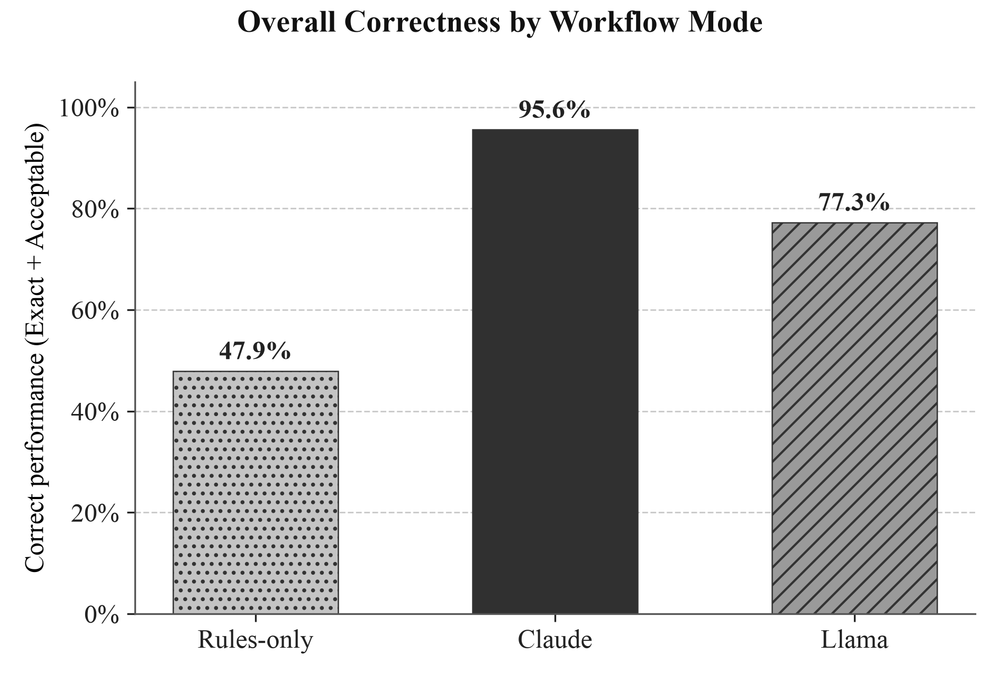
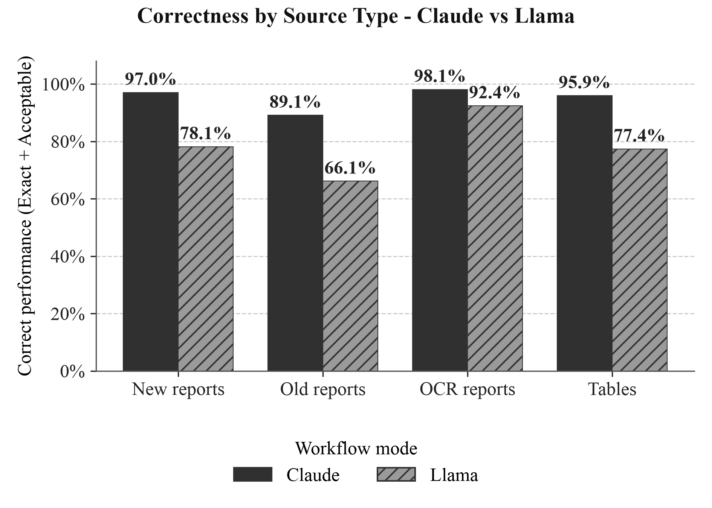
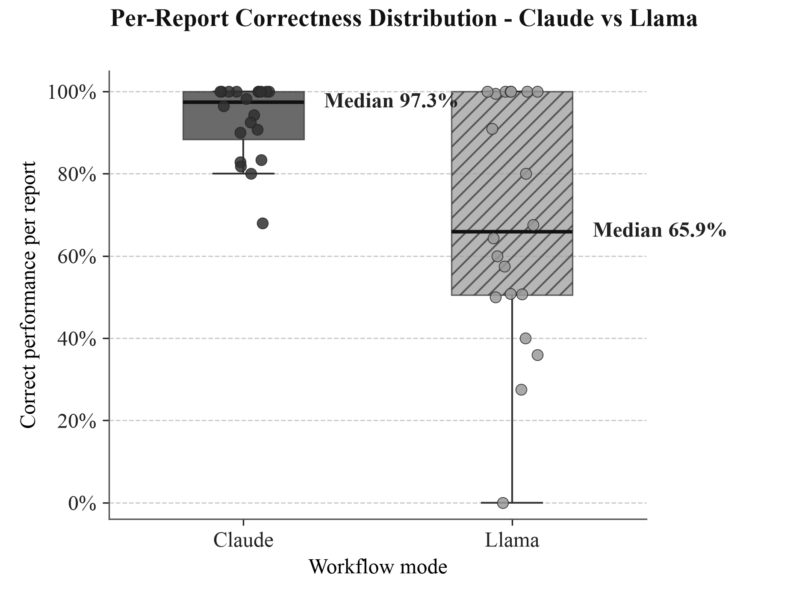

# Discussion of the evaluation charts

This note interprets the evaluation charts produced by `generate_charts.py` (shown in `README.md` and
saved in `charts_output/`). All numbers are the **Correct** share, where *Correct = Exact +
Acceptable*, scored against the hand-made gold standards on the evaluation sample (20 reports). The
three modes compared are **Rules-only** (the full deterministic pipeline, every AI step off), **Claude**
(the frontier-LLM hybrid path) and **Llama** (the cloud open-model path).

> **Read this first: caveats.** The sample is 20 reports and the gold standards are hand-built and
> deliberately conservative, so treat the figures as *relative* comparisons between modes rather
> than absolute accuracies. Percentage gaps of a few points are within noise; the large, consistent
> patterns below are what matter.

## 1. The LLM summary is what makes the pipeline usable (Chart 1)

Overall Correct is **47.9% Rules-only, 77.3% Llama, 95.6% Claude**. On its own, the deterministic
pipeline gets fewer than half of the values right. Adding an LLM to read the report and assemble the
pottery summary is the single biggest driver of quality. Claude roughly **doubles** the rules-only
baseline and sits ~18 points above Llama. The takeaway: the LLM summary layer is not a cosmetic
add-on. It is where most of the correctness comes from, and the *choice* of LLM matters a lot.

## 2. The two LLMs differ in their verdict mix: Llama mostly *omits* values (verdict composition)

The four-verdict breakdowns (Charts 2, 3, 5, 6) show *how* each model is wrong, not just how often.
Aggregated over everything:

| Verdict | Claude | Llama |
|---|---|---|
| Correct (Exact + Acceptable) | 95.6% | 77.3% |
| Incorrect | 2.4% | 4.7% |
| **Missing** | **1.2%** | **14.9%** |
| Overclaim | 0.8% | 3.2% |

Llama's main gap is **Missing** values (14.9% vs Claude's 1.2%); it *omits* values far more
than it gets them *wrong*. Outright wrong answers (Incorrect) and invented ones (Overclaim) are
low for both models. This distinction matters: Llama is mostly a **recall** problem (things
it should have reported but didn't), not a hallucination problem. That is encouraging for an open
model, and it suggests the gap is partly closeable with better prompting and coverage rather than
reflecting a model that is fundamentally unreliable.

## 3. Source type: both are strongest on OCR, most challenged on old reports (Charts 2 to 4)

(Each source-type bucket is n=5 reports.)

Correct share by source type:

| Source type | Claude | Llama |
|---|---|---|
| New reports | 97.0% | 78.1% |
| Old reports | 89.1% | 66.1% |
| OCR reports | 98.1% | 92.4% |
| Tables | 95.9% | 77.4% |

Two patterns stand out. First, **old reports are the most challenging for both models** (Claude
89.1%, Llama 66.1%): older write-ups are less structured, so there is more for the model to misread
or miss.
Second, **Claude is consistently robust** (89-98% across every source type, a ~9-point spread),
while **Llama is much more variable** (66-92%, a ~26-point spread). The two models are *closest* on
OCR reports (98.1% vs 92.4%), and furthest apart on old reports (~23 points). Most of Claude's
advantage therefore comes from handling the messy, unstructured sources that Llama finds most
challenging. (Charts 2 and 3 show the same data with the Incorrect/Missing/Overclaim split per source
type, confirming that Llama's losses on old reports are again mostly *Missing* values.)

## 4. Field: Claude is uniformly strong; Llama is uniformly lower (Charts 5 to 6)

Correct share by extracted field:

| Field | Claude | Llama |
|---|---|---|
| site_name | 95.9% | 75.1% |
| pot_name | 97.9% | 81.9% |
| typology | 97.9% | 77.5% |
| start_date | 93.8% | 76.3% |
| end_date | 92.2% | 75.5% |

Claude is strong on every field (92-98%); the **dates** (`start_date`, `end_date`) are its most
challenging fields (still 92-94%). That is unsurprising, since chronology requires combining typology
lookups with in-text date reasoning. Llama is **lower but flat** (75-82%): no single field drops
sharply, it is just uniformly behind, and its best field (`pot_name`, 81.9%) is still below Claude's
*lowest* (92.2%). The flatness again points to a general recall and coverage gap rather than any
single field being the problem.

## 5. Per-report spread: Claude is reliable, Llama less so (Chart 7)

Averages hide reliability. Per report (n = 20):

| | Claude | Llama |
|---|---|---|
| Median | 97.3% | 65.9% |
| Mean | 92.9% | 68.7% |
| Min | 68.0% | **0.0%** |
| Max | 100.0% | 100.0% |

Claude's reports are **tightly clustered near the top** (median 97.3%, lowest single report still
68%), so it is dependable report-to-report. Llama is **wide and bimodal**: it can match Claude on
some reports (max 100%), but its lowest report scores **0%**, meaning there is at least one report
where it essentially recovered nothing. For a workflow meant to run unattended over a batch, this
spread matters as much as the average: Claude stays high even on its most challenging report (still
68%), whereas Llama can drop to near zero on an individual report.

## Bottom line

- **Use an LLM summary**: it roughly doubles the rules-only baseline (Chart 1).
- **Claude is the clear choice for accuracy and reliability** (95.6% overall, tight per-report
  spread). It is robust across source types and fields, with dates its most challenging (still ~92%+).
- **Llama is a viable open-model alternative but with caveats**: ~77% overall, its gap is mostly *missing*
  values (a recall problem, not hallucination), it is most challenged on old/unstructured reports, and
  it is far less consistent report-to-report, so it benefits most from human review.
